# Langkah-langkah membuat repository:
1. Tanda + pada kanan atas dipilih kemudian dipilih 'New Repository' setelah itu diberi nama serta deskripsi.
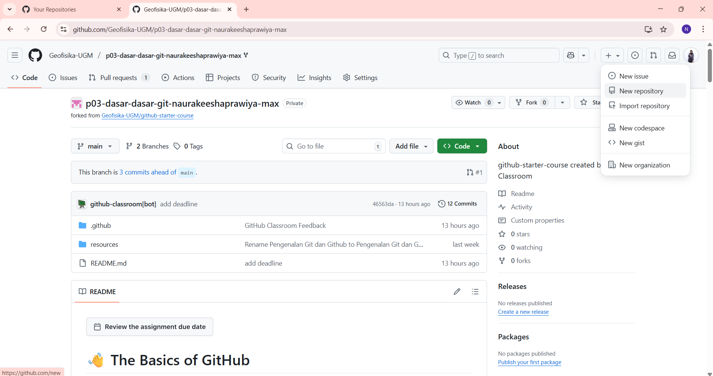

2. Repository Name diisi dan Deskripsi, kemudian visibility di-setting ke public serta add README diaktifkan. Selanjutnya, create repository dipilih.

# Langkah-langkah menambahkan repository ke VSCode:
1. Anaconda Promt dibuka untuk menuju ke directory penyimpanan file dengan digunakan dir (cek directory) dan cd (change directory).
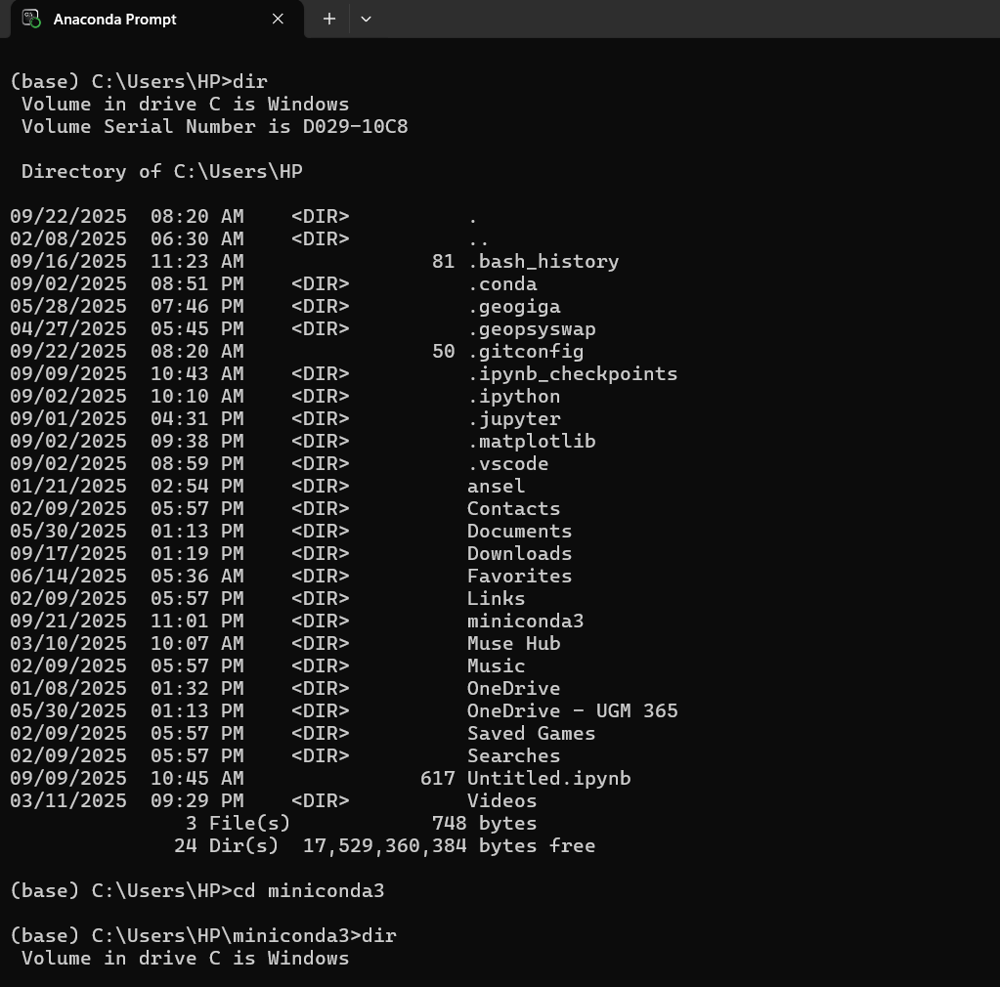
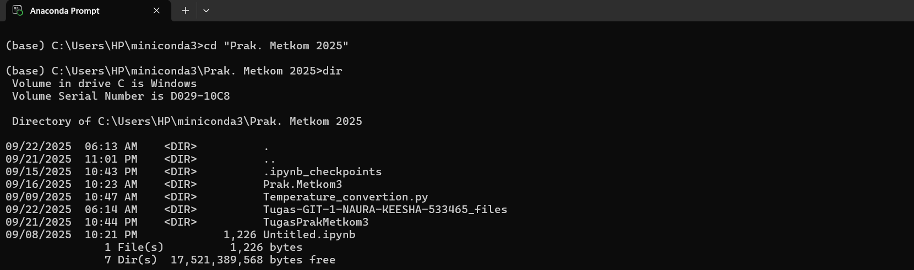

2. Digunakan git clone dengan format git clone (linkcoderepository).
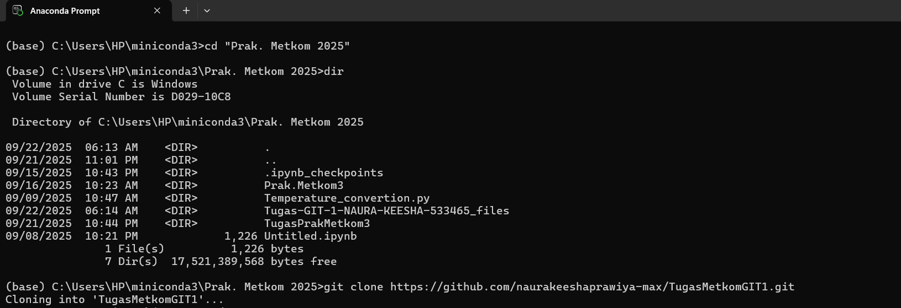

3. Digunakan dir dan cd kembali ke repository yang dibuat dengan format dir (nama repository yang dibuat) kemudian cd (nama repository yang dibuat).
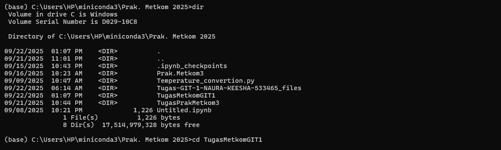

4. Digunakan git config dengan format git config --global user.email "(nama email yang dipakai sebagai akun di GitHub)"

5. Kemudian digunakan juga git init.
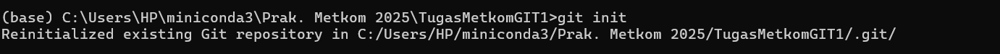

# Langkah-langkah membuat README:
1. Setelah itu, VSCode dibuka dan dipilih file kemudian dipilih open folder untuk membuka folder repository yang dibuat.
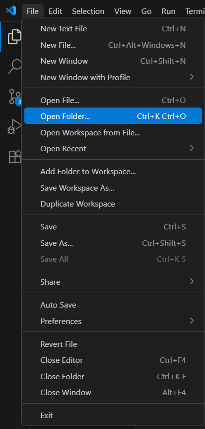

2. README.md dibuka dan ditambahkan isi.
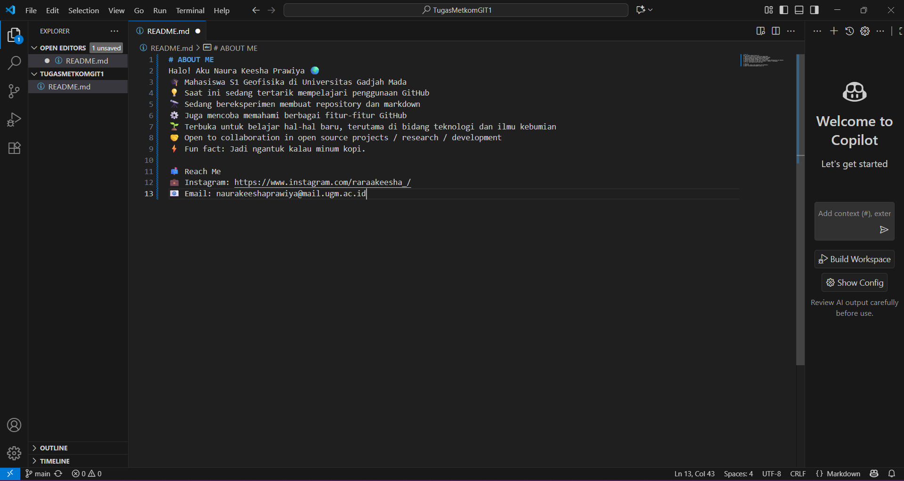

3. README.md yang sudah diisi, disimpan dengan cara dipilih file kemudian dipilih save.

# Langkah-langkah membuat MARKDOWN:
1. Dipilih New File kemudian dinamai dengan format namafile.md kemudian diisi markdown.
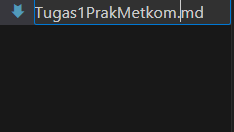

2. Gambar lampiran di dalam folder yang sama dimasukkan ke markdown 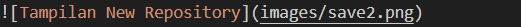

3. Markdown disimpan dengan cara cara dipilih file kemudian dipilih save.
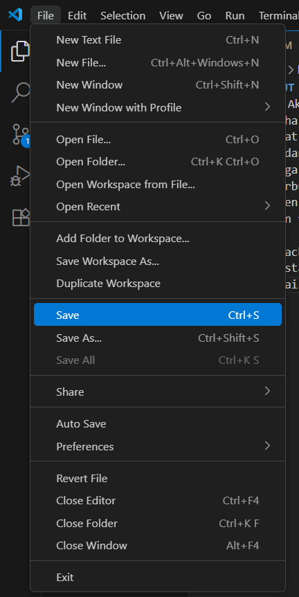

4. Dibuka kembali jendela Anaconda Prompt dan digunakkan git add . atau git add . "README.md".

5. Digunakan git commit -m "linkcoderepository".

6. Digunakan git push origin main.

7. Buka kembali GitHub kemudian dimuat ulang.